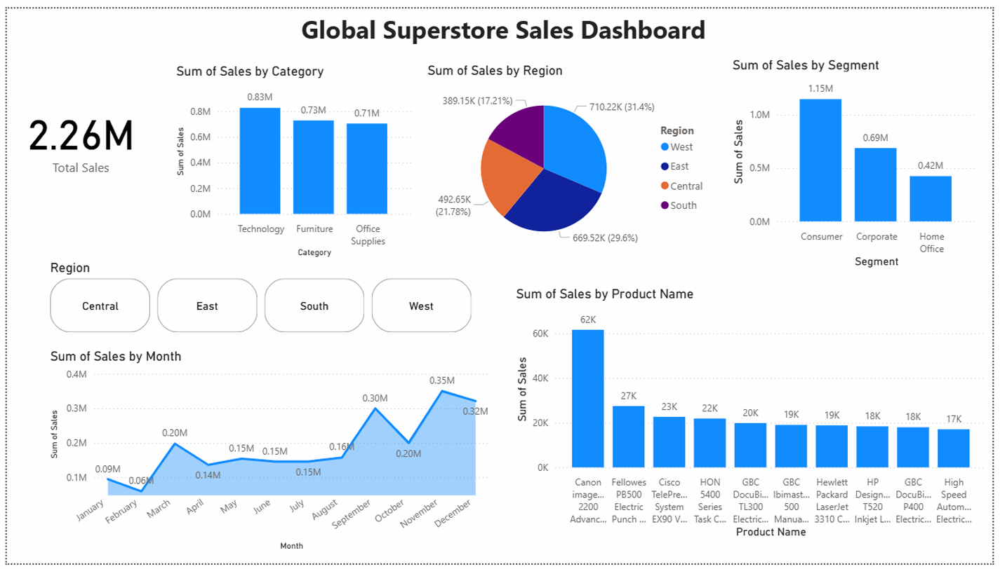

# Superstore Sales Analysis and Visualization

## 📌 Project Overview

This project focuses on analyzing Superstore sales data to identify important sales trends and business insights. The analysis explores sales performance across different categories, regions, customer segments, products, and states.

Python was used for data cleaning, analysis, and visualization, while Power BI was used to create an interactive dashboard.

## 🛠️ Tools Used

Python · Pandas · NumPy · Matplotlib · Jupyter Notebook · Google Colab · Power BI

## 📊 Analysis

The project includes sales analysis by category, region, and customer segment. It also covers the top 10 products and states by sales, along with monthly sales trend analysis to understand overall sales patterns.

## 🎯 Objective

To analyze sales data and extract meaningful insights that can support data-driven business decisions.
